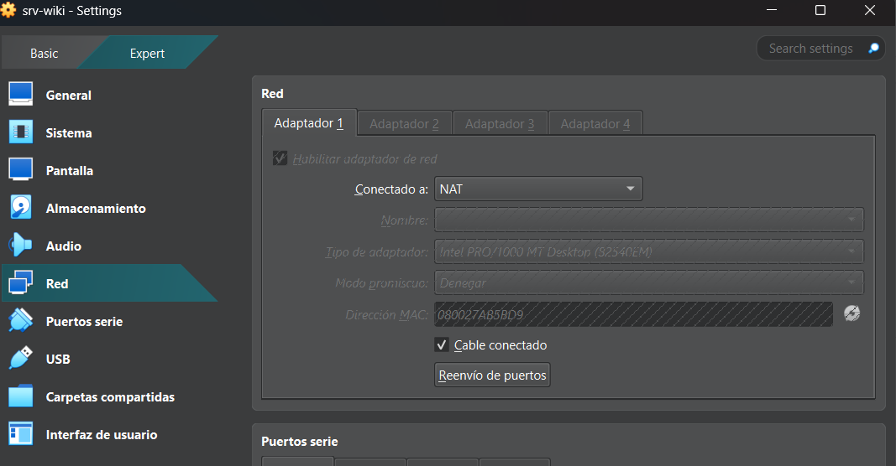
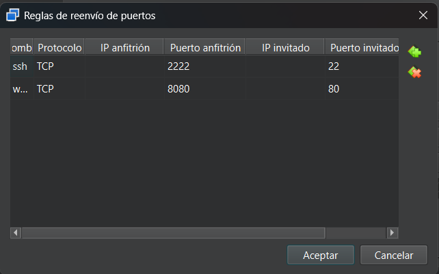

ESTUDIANTE: Jeanliette Munoz Alegría
             
             ASIGNATURA: TI3V35 - Sistemas Operativos
             DOCENTE: Rubén Schnettler Lucero
             SECCIÓN: TI3V35 
             INSTITUCIÓN: INACAP Valparaíso

---

## 1. OBJETIVO DEL LABORATORIO
El objetivo de este laboratorio es instalar y configurar un servidor virtual con Ubuntu Server 24.04 LTS sin interfaz gráfica. Toda la administración se realizará exclusivamente a través de la línea de comandos para simular un entorno de trabajo real en la industria. En este servidor configuraremos la red, las actualizaciones del sistema, el firewall, los permisos de archivos y el servidor web Nginx para publicar y acceder a nuestra wiki desde el computador anfitrión.

---

## 2. TOPOLOGÍA 
Para conectar la máquina virtual de manera segura y poder acceder a ella desde nuestro computador físico (anfitrión), configuramos una topología de red sencilla estructurada de la siguiente manera:

Computador Anfitrión (PC Físico): Es el equipo desde donde trabajamos, utilizando el navegador web para ver los resultados y un cliente SSH nativo para ingresar al servidor.

Servidor Virtual (VM Linux srv-wiki): Es el sistema Ubuntu Server (sin entorno gráfico) configurado en modo de red NAT para que tenga salida a internet y pueda descargar paquetes y actualizaciones.

Reenvío de Puertos (Port Forwarding): Configuración realizada en VirtualBox que permite comunicar el PC físico con la máquina virtual a través de dos canales:

Acceso Web (Puerto 8080 Anfitrión -> Puerto 80 VM): Permite ver la wiki en React (servida por Nginx) directamente en el navegador del computador físico.

Acceso SSH (Puerto 2222 Anfitrión -> Puerto 22 VM): Permite conectarse de forma remota y segura a la consola del servidor para administrarlo.

---

## 3. ESQUEMA DE INTERFACES ACTIVO 
Para verificar la estabilidad del enlace antes de la fase de compilación, se adjunta la captura visual de red obtenido directamente del gestor de VirtualBox.

