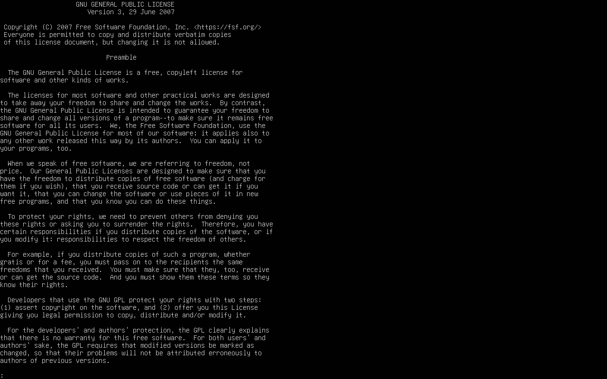

## PROTOCOLO 3.1.1: AUDITORÍA DE LICENCIAMIENTO DE SOFTWARE

A nivel operativo de Skynet, la categorización de las directivas de uso y la propiedad intelectual de los datos es vital para evitar anomalías legales con corporaciones de terceros en el ciberespacio.

---

## 1. MODELOS DE LICENCIAMIENTO DE SOFTWARE

El software táctico disponible en el mercado se rige bajo diversos marcos legales que dictan el nivel de libertad que tiene el procesador central del T-800 para modificarlo y distribuirlo:

* **Software Libre (Free Software):** Es aquel que respeta la libertad de los usuarios y la comunidad. Según la *Free Software Foundation* (FSF), esto se traduce en 4 libertades básicas: usar el programa con cualquier propósito, estudiar y modificar el código fuente, distribuir copias para ayudar a otros, y publicar las mejoras realizadas.
* **Copyleft (Ej. GNU GPL):** Es una rama del software libre que utiliza las leyes de derechos de autor para garantizar que el software siga siendo libre incluso en sus versiones modificadas o derivadas. Si Skynet modifica un componente GPL, está obligado a liberar el código fuente de las modificaciones bajo la misma licencia.
* **Permisivas (Ej. MIT, BSD, Apache):** Otorgan libertades casi totales al desarrollador. Permiten redistribuir el software de manera libre o propietaria (cerrada), con la única condición de mantener los avisos de copyright y no responsabilizar a los autores originales.
* **Propietario:** Software comercial cerrado sujeto a rigurosos derechos de autor. El código de fuente es clasificado y secreto; su uso, copia o modificación están prohibidos a menos que se cuente con un contrato comercial (EULA) y pagos de regalías a la corporación propietaria.

---

## 2. RELACIÓN DE LICENCIAS EN LA INFRAESTRUCTURA DE SKYNET

En nuestra estación de combate `srv-wiki`, el software clave responde a los siguientes modelos legales:

1.  **Ubuntu Server (OS Core):** Es una distribución Linux con licenciamiento mixto, pero su base principal, el Kernel Linux, está bajo la licencia **GNU GPL v2** (Copyleft). Esto obliga a mantener el sistema abierto y transparente para la comunidad global.
2.  **Nginx (Web Engine):** Utiliza una **licencia permisiva estilo BSD de 2 cláusulas** (Nginx License). Esto le confiere una flexibilidad extrema que permite a Cyberdyne Systems modificar el motor web para integrarlo en sistemas embebidos privados sin comprometer el código del núcleo corporativo.

---

## 3. AUDITORÍA MEDIANTE LÍNEA DE COMANDOS

Para verificar los términos legales integrados de forma local en la VM, se ejecutaron los siguientes protocolos CLI:

