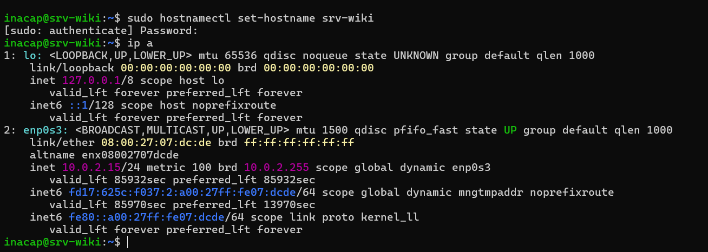
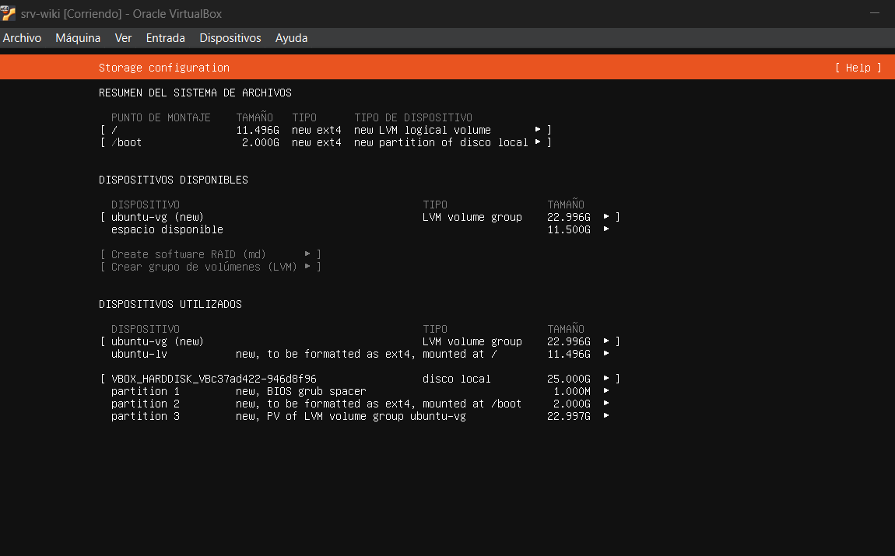
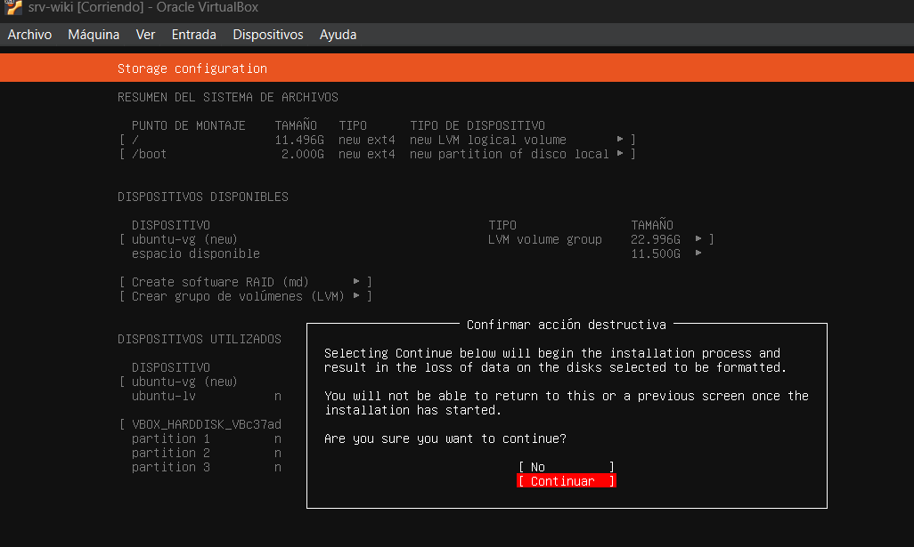
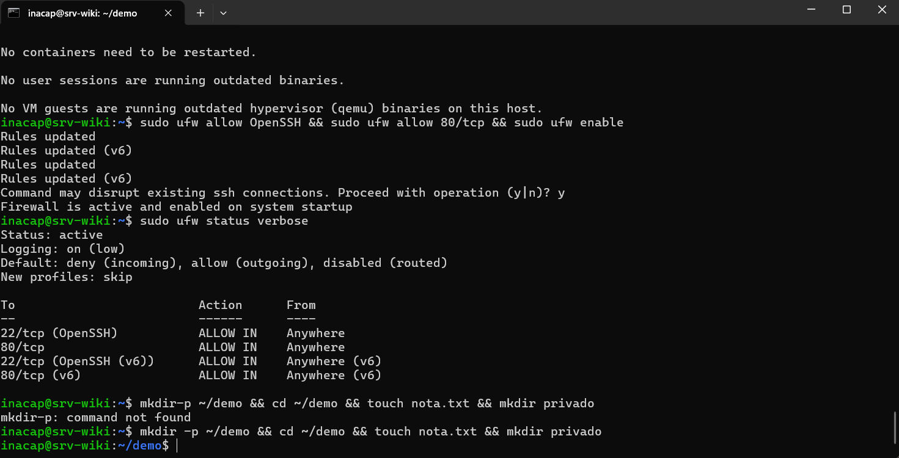

## PROTOCOLO 3.1.2: INSTALACIÓN Y ENDURECIMIENTO DE RED 

Para poner en marcha el servidor de forma segura, es necesario configurar la red, asignarle un nombre único al equipo, instalar las últimas actualizaciones de seguridad y activar el cortafuegos (UFW) para proteger el sistema.

---

## 1. CONCEPTOS DE ENLACE TÁCTICO

¿Qué es NAT (Network Address Translation)?
Es una tecnología que permite que varios computadores de una red privada salgan a internet usando una sola dirección IP pública. En nuestro laboratorio, VirtualBox se encarga de esto para que la máquina virtual pueda conectarse a internet y descargar paquetes de los repositorios de Ubuntu de forma segura.

¿Para qué sirve el Reenvío de Puertos (Port Forwarding)?
Como la red NAT oculta la máquina virtual para que no sea accesible directamente desde fuera, el reenvío de puertos crea un enlace directo entre un puerto del PC físico y un puerto de la máquina virtual. Sin esta configuración, sería imposible conectarse por SSH al puerto 22 de la VM o ver la página web del puerto 80 desde nuestro navegador en el computador anfitrión.

DHCP frente a IP Fija (Estática):

DHCP: Entrega la dirección IP y la configuración de red de forma automática y temporal. No se recomienda usarlo en servidores porque si la IP cambia en cualquier momento, los usuarios perderían el acceso a los servicios alojados.

IP Fija: Se configura manualmente en el sistema para que no cambie nunca. Es el estándar para servidores en producción, ya que garantiza que el servidor siempre esté localizable en la misma dirección.

---

## 2. SECUENCIA DE COMANDOS DE DESPLIEGUE

```bash
# Configurar la identidad táctica del servidor en la red de Skynet
sudo hostnamectl set-hostname srv-wiki

# Identificar la dirección IP local de enlace asignada por VirtualBox
ip a

# Descargar índices e inyectar todas las actualizaciones críticas de seguridad (hardenización)
sudo apt update && sudo apt upgrade -y

# Endurecimiento del Cortafuegos (UFW)
# ADVERTENCIA CRÍTICA: Se debe abrir el puerto SSH primero, de lo contrario se perderá el control de la terminal
sudo ufw allow OpenSSH
sudo ufw allow 80/tcp
sudo ufw enable

# Inspeccionar el escudo protector del firewall con detalles
sudo ufw status verbose
```

### 3. EVIDENCIA DE CONFIGURACIÓN DEL SISTEMA

A. Identidad Táctica (Hostname)  


B. Mapeo de Direcciones de Red (IP Address)  


C. Inyección de Código de Seguridad (Upgrades)  


D. Reglas del Escudo Térmico (UFW Status)  
   