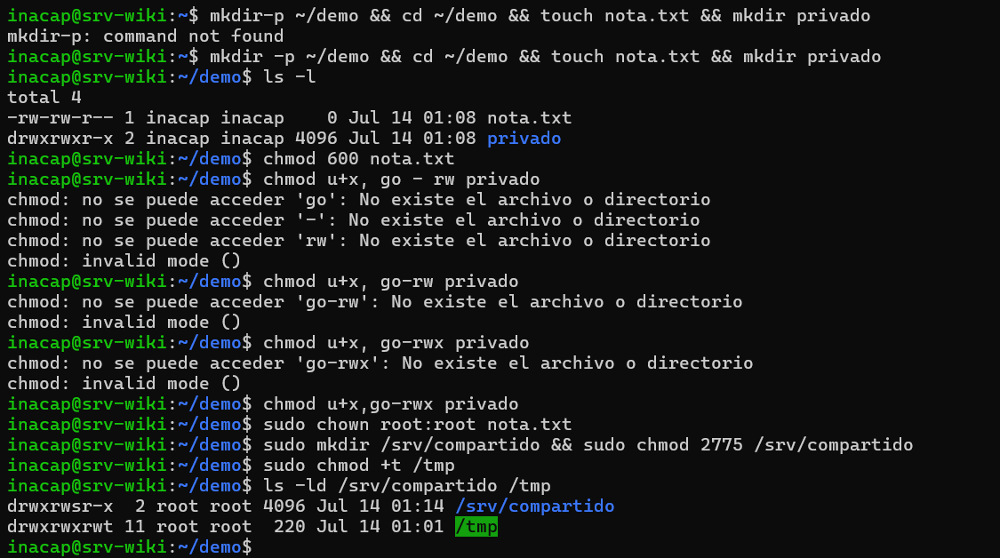

## PROTOCOLO 3.1.3: CONTROL DE ACCESOS Y CAPAS ESPECIALES POR CLI 

Para que Skynet impida el sabotaje de la resistencia humana, cada archivo de comando, binario y carpeta debe estar estrictamente regulado con permisos de bajo nivel y directivas de pertenencia del sistema.

---

## 1. COMPRENSIÓN METADATA DE SEGURIDAD 

Al ejecutar un escaneo en frío con 'ls -l', el procesador central del T-800 lee un patrón de 10 caracteres como el siguiente:

¿Cómo se lee un permiso como -rw-rw-r--?
Este bloque de texto nos dice exactamente quién puede hacer qué con el archivo:

El primer carácter (-): Indica que es un archivo común y corriente (si fuera un directorio, veríamos una d).

Los siguientes tres (rw-): Son los permisos del dueño (user), que puede leer ($r$) y escribir ($w$), pero no ejecutarlo.

Los del medio (rw-): Son los permisos del grupo, que también tiene acceso para leer y escribir.

Los últimos tres (r--): Son los permisos para otros (cualquier otro usuario del sistema), quienes únicamente pueden leer el archivo, sin posibilidad de modificarlo.

Cambio de permisos:
Modo Numérico vs. Modo Simbólico Modo Numérico (ej. chmod 644): Funciona sumando el valor de cada permiso: Lectura ($r$) vale 4, Escritura ($w$) vale 2 y Ejecución ($x$) vale 1. Por ejemplo, un 6 (4+2) significa leer y escribir, mientras que un 4 es solo leer. Es la opción más rápida cuando queremos reconfigurar todos los permisos de una sola vez. 
Modo Simbólico (ej. chmod u+x, go-rwx): Usa letras para identificar a quién le cambiamos el permiso (Usuario u, Grupo g, Otros o) y los símbolos de más (+) o menos (-) para añadir o quitar accesos (r, w, x). 

Es la mejor alternativa cuando solo queremos modificar un detalle específico sin alterar el resto de la configuración.Cada indicador representa una operación atómica:

---

## 3.  EL COMANDO `CHOWN`

¿Para qué sirve el comando chown?
Sirve para cambiar el propietario (dueño) y/o el grupo de un archivo o carpeta. Se usa mucho en servidores cuando necesitamos que un archivo que creamos nosotros pase a ser propiedad de un servicio del sistema (como el usuario de Nginx) para que pueda funcionar correctamente.

---

## 4. PERMISOS ESPECIALES DE SEGURIDAD (SETGID Y STICKY BIT)

Para asegurar el almacenamiento compartido y la integridad de los directorios públicos, se aplican técnicas avanzadas de administración:

Permisos Especiales (SetGID y Sticky Bit)
SetGID (se identifica con una s en el grupo, ej. drwxrwsr-x): Cuando lo activamos en una carpeta compartida, obliga a que cualquier archivo o subcarpeta que se cree adentro herede automáticamente el grupo de la carpeta principal, en lugar del grupo del usuario que lo creó. Es fundamental para trabajar de forma colaborativa sin tener que estar arreglando los permisos a cada rato.

Sticky Bit (se identifica con una t al final, ej. en /tmp): Sirve para mantener el orden en carpetas públicas donde muchos usuarios tienen permiso para escribir. Lo que hace es asegurar que solo el dueño de un archivo (o el usuario root) pueda borrarlo o cambiarle el nombre, evitando que un usuario borre el trabajo de otro por accidente.

---

## 5. EVIDENCIA DE PERMISOS EN LA CONSOLA 

A continuación, se adjunta el mapa de estado de permisos de archivos generado en la consola para auditar los cambios aplicados en la sección de demostración:

*(Captura que muestra el cambio de permisos con chmod y la modificación de propietario con chown.)*

*(Captura que ilustra el comportamiento de los permisos especiales setgid y sticky bit en directorios compartidos.)*
