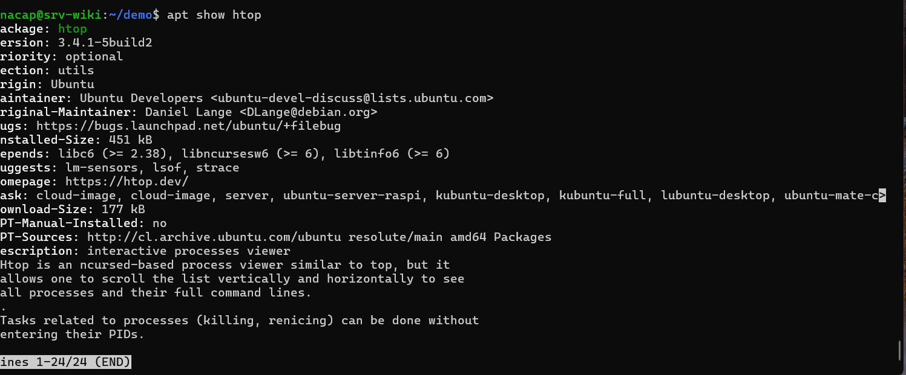
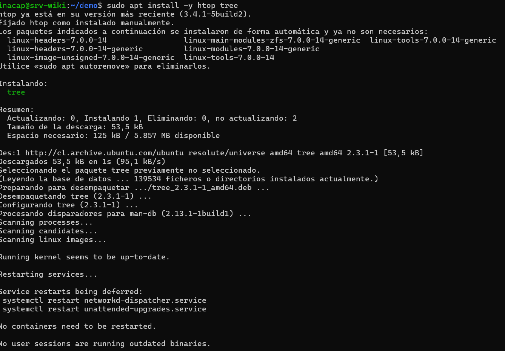
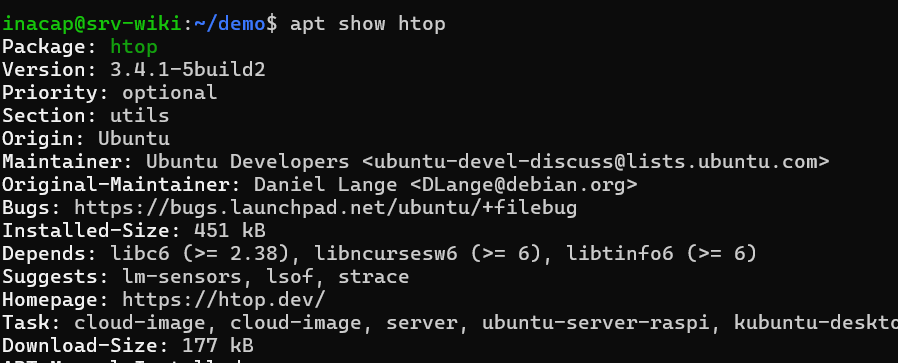
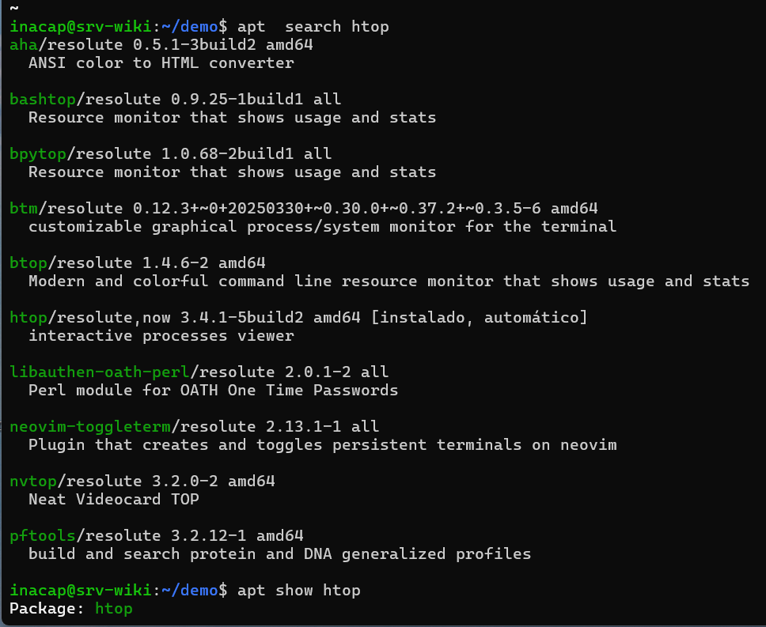

## PROTOCOLO 3.1.4: GESTIÓN DE PAQUETES CON APT 

Skynet requiere herramientas robustas de diagnóstico del hardware en tiempo real.  Para instalarlas de forma segura, el sistema de paquetes APT (Advanced Package Tool) se rige bajo una secuencia de prioridades estrictas.

---

## 1. FLUJO DE INSTALACION CON APT

Para buscar e instalar cualquier programa de forma segura en la consola, seguimos un proceso de cuatro pasos bien definidos:

1. update: Descarga la lista más reciente de los programas disponibles en los servidores de Ubuntu. No instala nada todavía, solo le avisa a nuestra máquina virtual qué versiones nuevas existen en internet.

2. search: Nos permite buscar una herramienta específica por su nombre o descripción dentro de esa lista actualizada.

3. show: Muestra la información técnica de un paquete (cuánto pesa, qué versión es y qué otros componentes necesita para funcionar). Es un paso clave para evaluar si es factible instalarlo.

4. install: Descarga el programa y lo instala automáticamente en el sistema junto con todo lo necesario para que funcione de inmediato.

---

## 2. CRITERIO DE FACTIBILIDAD

Para revisar el uso de memoria y procesador de nuestro servidor en tiempo real, comparamos dos opciones:

top: El monitor que viene por defecto en el sistema. Cumple su función, pero es muy básico, en blanco y negro, y difícil de interpretar rápido.

htop: Una versión interactiva, mucho más visual y fácil de usar, que muestra gráficos de colores para entender el rendimiento de un vistazo.

Antes de instalarlo, usamos el comando apt show htop para revisar sus requisitos. Confirmamos que es sumamente liviano (pesa solo unos 177 kB) y no requiere librerías raras que puedan dar problemas en el servidor.

Por su bajísimo consumo de recursos y lo mucho que facilita el trabajo de monitoreo, decidimos que htop era la opción más factible y conveniente para este laboratorio.

---

## 3. INSTALACIÓN DE DIAGNÓSTICOS EN CALIENTE 

# Paso 1: Localizar los metadatos lógicos antes del despliegue del paquete htop
apt show htop

# Paso 2: Inyectar htop y tree al repositorio local de la VM
sudo apt install -y htop tree

# 4. EVIDENCIA DE INSTALACIÓN Y VERIFICACIÓN 
A continuación, se documenta la inyección del paquete htop en la base de datos central de nuestro sistema operativo:

