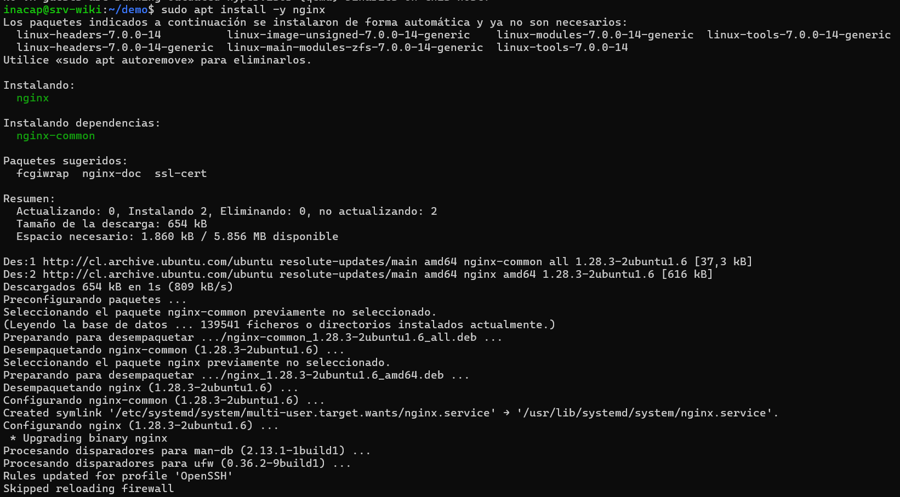
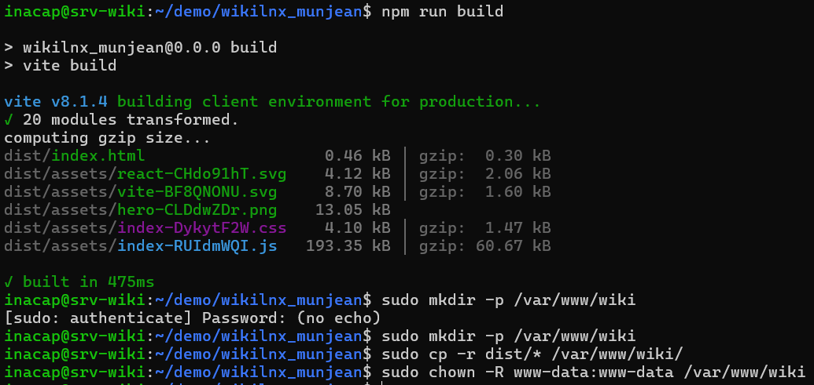
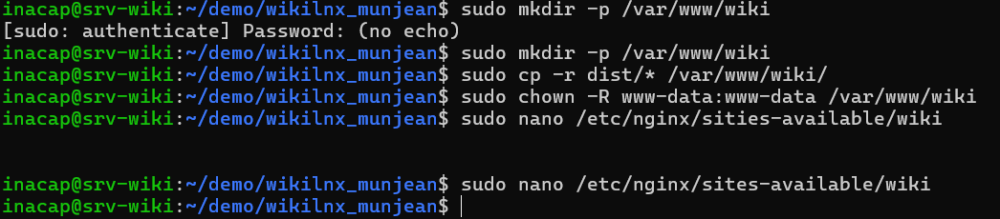
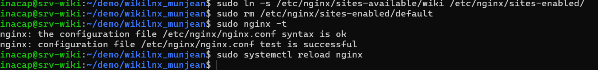
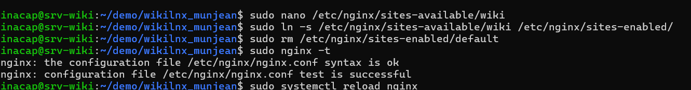
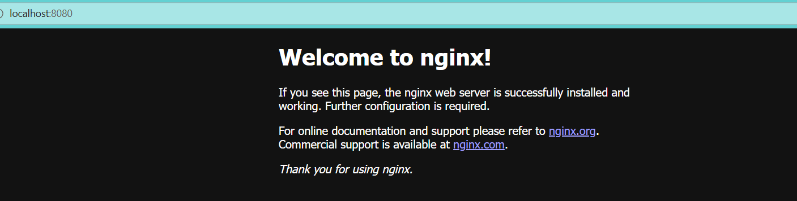
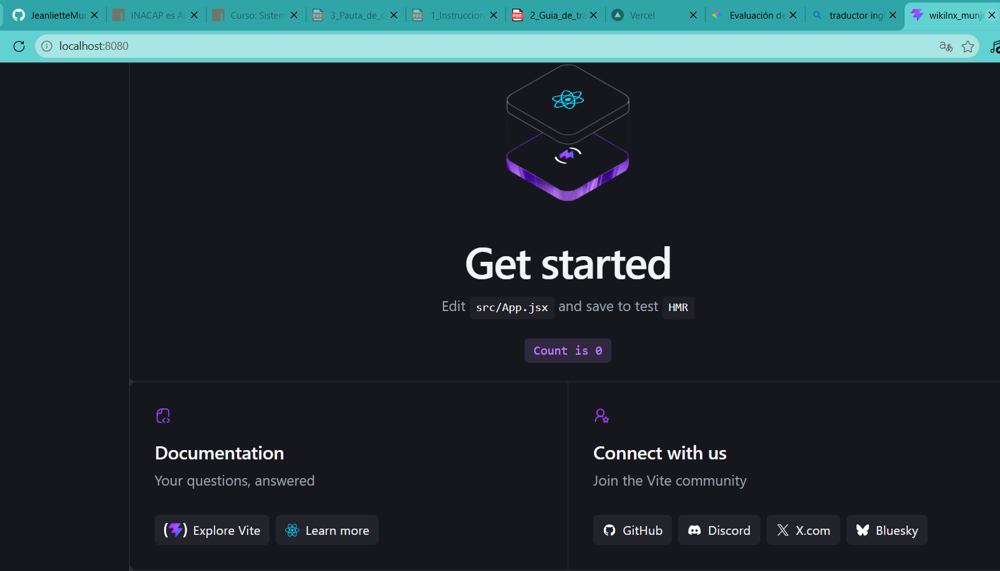

## PROTOCOLO 3.1.4: LEVANTAMIENTO, MONTAJE Y CONFIGURACIÓN DE HOSTS VIRTUALES

La fase final de la misión consiste en desplegar nuestra Wiki Web construida con React de forma nativa en el servidor `srv-wiki` de Skynet usando el servidor HTTP Nginx de alto rendimiento.

---

## 1. SECUENCIA PASO A PASO DEL DESPLIEGUE

### A. Instalación de Nginx e infraestructura de construcción
Se inyecta el motor web en el sistema y se levantan los componentes para compilar nuestra aplicación React directamente en el servidor:

```bash
# Instalar el motor web Nginx y verificar su estado inicial
sudo apt install -y nginx
systemctl status nginx

# Instalar Node.js, NPM y Git para descargar y compilar la wiki React
sudo apt install -y nodejs npm git
```



### B. Compilación del código estático de la wiki
Clonamos nuestro repositorio de GitHub en el servidor y compilamos una estructura optimizada y ligera para entornos de producción en internet:

```bash
git clone https://github.com/JenlietteMunoz-2026/wikilnx_munjean.git
cd wikilnx_munjean
npm install
npm run build
```

> Nota: El comando npm run build compila la SPA de React y produce los archivos listos dentro del directorio local dist/.



### C. Despliegue en el servidor web y gestión de permisos
Se crea el directorio raíz para el host virtual y se copian los archivos compilados de producción:

```bash
sudo mkdir -p /var/www/wiki
sudo cp -r dist/* /var/www/wiki/

# Transferencia de pertenencia a la cuenta de servicio de Nginx
sudo chown -R www-data:www-data /var/www/wiki
```

> Nota: www-data es la cuenta de usuario del sistema utilizada por Nginx para leer de forma exclusiva la web, previniendo el uso del usuario privilegiado root.



## 2. CONFIGURACIÓN DEL HOST VIRTUAL EN EL SERVIDOR
Para que Nginx responda de forma predeterminada sirviendo nuestra Wiki de React, creamos un archivo de configuración del host:

```bash
sudo nano /etc/nginx/sites-available/wiki
```

Bloque de configuración inyectado (server block):

```nginx
server {
    listen 80 default_server;
    root /var/www/wiki;
    index index.html;

    location / {
        try_files $uri $uri/ /index.html;
    }
}
```

> Explicación: try_files asegura que cualquier ruta secundaria de la aplicación React sea redirigida a index.html de manera interna, permitiendo que el React Router se encargue de la navegación sin que Nginx lance errores 404.

### D. Enlace y activación del sitio
Para activar las directivas en el sistema, creamos un enlace simbólico entre carpetas y removemos la página predeterminada de Nginx:

```bash
# Crear el enlace simbólico hacia sites-enabled
sudo ln -s /etc/nginx/sites-available/wiki /etc/nginx/sites-enabled/

# Eliminar el host virtual por defecto de Nginx
sudo rm /etc/nginx/sites-enabled/default

# Validar que la sintaxis de configuración no presente errores de formato
sudo nginx -t

# Recargar los demonios de Nginx en caliente sin interrumpir el servicio activo
sudo systemctl reload nginx
```



## 3. COMPROBACIÓN DE DESPLIEGUE ACTIVO
Para verificar que Skynet sirve correctamente el servicio web, se adjuntan las capturas del correcto despliegue e interacción remota:








